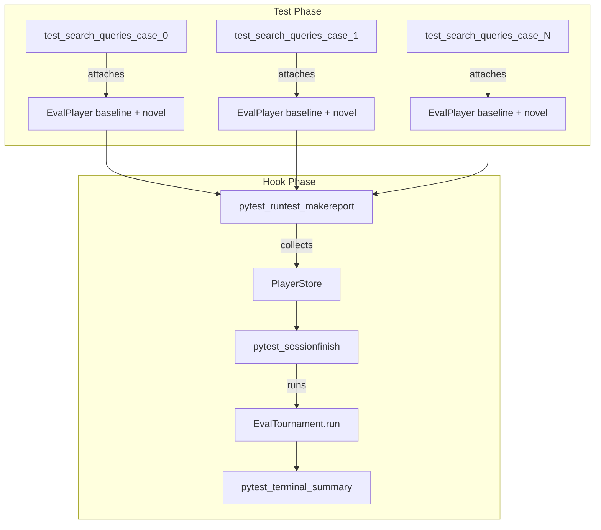
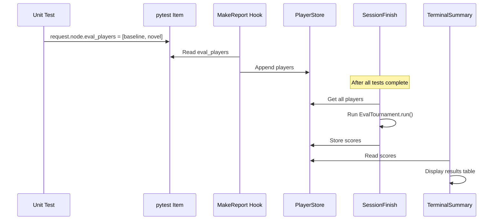

# Eval Plugin Architecture Plan

## Overview

Transform the monolithic `test_search_queries` test into a plugin-based architecture that separates concerns:

- **Tests**: Generate agent responses and attach `EvalPlayer` objects to test items
- **Plugin Hooks**: Collect players, run Bradley-Terry tournament, display results

## Architecture Diagram



## Data Flow



## File Changes

### 1. Plugin Implementation: [src/deepresearcher2/plugin.py](src/deepresearcher2/plugin.py)

Extend the existing plugin with all seven hooks:

```python
from __future__ import annotations
from dataclasses import dataclass, field
from typing import TYPE_CHECKING
import asyncio

import pytest
from pytest import Config, Item, Parser, Session, CallInfo, TerminalReporter

from deepresearcher2.evals.evals import EvalPlayer, EvalGame, EvalTournament
from deepresearcher2.logger import logger

if TYPE_CHECKING:
    from _pytest.terminal import TerminalReporter

ASSAY_MODES = ("evaluate", "new_baseline")

@dataclass
class EvalPluginState:
    """Shared state for evaluation plugin across the test session."""
    players: list[EvalPlayer] = field(default_factory=list)
    criterion: str = ""
    max_std_deviation: float = 2.0
    baseline_path: str | None = None
    scores_baseline: list[float] = field(default_factory=list)
    scores_novel: list[float] = field(default_factory=list)
    passed: bool = False

# Global state instance (attached to config in pytest_configure)
_plugin_state: EvalPluginState | None = None
```

### 2. Hooks Implementation

#### Hook 1: `pytest_addoption`

Add CLI options for evaluation configuration.

```python
def pytest_addoption(parser: Parser) -> None:
    group = parser.getgroup("eval", "Evaluation plugin options")
    group.addoption(
        "--eval-criterion",
        action="store",
        default="Which shows more genuine curiosity and creativity?",
        help="Evaluation criterion for Bradley-Terry scoring",
    )
    group.addoption(
        "--max-std-deviation",
        action="store",
        type=float,
        default=2.0,
        help="Maximum standard deviation for adaptive strategy",
    )
    group.addoption(
        "--baseline-path",
        action="store",
        default=None,
        help="Path to baseline scores JSON for comparison",
    )
    # Keep existing --assay-mode option
    group = parser.getgroup("recording")
    group.addoption(
        "--assay-mode",
        action="store",
        default="evaluate",
        choices=ASSAY_MODES,
        help='Assay mode. Defaults to "evaluate".',
    )
```

#### Hook 2: `pytest_configure`

Register custom markers and initialize shared state.

```python
def pytest_configure(config: Config) -> None:
    global _plugin_state
    
    # Register the eval_curiosity marker
    config.addinivalue_line(
        "markers",
        "eval_curiosity: Mark test for curiosity evaluation scoring"
    )
    
    # Initialize plugin state
    _plugin_state = EvalPluginState(
        criterion=config.getoption("--eval-criterion"),
        max_std_deviation=config.getoption("--max-std-deviation"),
        baseline_path=config.getoption("--baseline-path"),
    )
    config._eval_plugin_state = _plugin_state  # Attach to config for access
    
    logger.debug(f"Eval plugin configured: criterion={_plugin_state.criterion}")
```

#### Hook 3: `pytest_sessionstart`

Initialize session-wide data structures.

```python
def pytest_sessionstart(session: Session) -> None:
    state = getattr(session.config, "_eval_plugin_state", None)
    if state:
        state.players.clear()  # Ensure clean slate
        logger.info("Eval plugin: Session started, player collection initialized")
```

#### Hook 4: `pytest_runtest_makereport` (Key Hook)

Capture `EvalPlayer` objects from test items.

```python
@pytest.hookimpl(tryfirst=True)
def pytest_runtest_makereport(item: Item, call: CallInfo) -> None:
    if call.when != "call":
        return
    
    state = getattr(item.config, "_eval_plugin_state", None)
    if state is None:
        return
    
    # Check if test has eval_curiosity marker
    if not item.get_closest_marker("eval_curiosity"):
        return
    
    # Extract EvalPlayer objects attached by the test
    eval_players: list[EvalPlayer] | None = getattr(item, "eval_players", None)
    if eval_players:
        state.players.extend(eval_players)
        logger.debug(f"Collected {len(eval_players)} players from {item.nodeid}")
```

#### Hook 5: `pytest_sessionfinish`

Run Bradley-Terry tournament after all tests complete.

```python
def pytest_sessionfinish(session: Session, exitstatus: int) -> None:
    state = getattr(session.config, "_eval_plugin_state", None)
    if state is None or not state.players:
        return
    
    logger.info(f"Eval plugin: Running tournament with {len(state.players)} players")
    
    # Run the tournament (async)
    from deepresearcher2.agents import EVALUATION_AGENT
    from pydantic_ai.settings import ModelSettings
    
    game = EvalGame(criterion=state.criterion)
    tournament = EvalTournament(players=state.players, game=game)
    
    async def run_tournament() -> list[EvalPlayer]:
        return await tournament.run(
            agent=EVALUATION_AGENT,
            model_settings=ModelSettings(temperature=0.0, timeout=300),
            max_standard_deviation=state.max_std_deviation,
        )
    
    scored_players = asyncio.run(run_tournament())
    
    # Calculate baseline vs novel scores (assuming even/odd idx pattern)
    n = len(scored_players) // 2
    state.scores_baseline = [p.score or 0.0 for p in scored_players[:n]]
    state.scores_novel = [p.score or 0.0 for p in scored_players[n:]]
    
    import numpy as np
    avg_baseline = np.mean(state.scores_baseline)
    avg_novel = np.mean(state.scores_novel)
    state.passed = avg_novel > avg_baseline
    
    logger.info(f"Tournament complete: baseline={avg_baseline:.4f}, novel={avg_novel:.4f}")
```

#### Hook 6: `pytest_terminal_summary`

Display scoring results in terminal output.

```python
def pytest_terminal_summary(
    terminalreporter: TerminalReporter,
    exitstatus: int,
    config: Config,
) -> None:
    state = getattr(config, "_eval_plugin_state", None)
    if state is None or not state.scores_baseline:
        return
    
    import numpy as np
    
    terminalreporter.write_sep("=", "Evaluation Results")
    terminalreporter.write_line(f"Criterion: {state.criterion}")
    terminalreporter.write_line(f"Players evaluated: {len(state.players)}")
    terminalreporter.write_line("")
    terminalreporter.write_line(f"Baseline avg score: {np.mean(state.scores_baseline):7.4f}")
    terminalreporter.write_line(f"Novel avg score:    {np.mean(state.scores_novel):7.4f}")
    terminalreporter.write_line("")
    
    status = "PASSED" if state.passed else "FAILED"
    terminalreporter.write_line(f"Evaluation: {status}")
```

#### Hook 7: `pytest_report_header`

Add configuration info to test run header.

```python
def pytest_report_header(config: Config) -> list[str]:
    state = getattr(config, "_eval_plugin_state", None)
    if state is None:
        return []
    
    return [
        f"eval-criterion: {state.criterion}",
        f"max-std-deviation: {state.max_std_deviation}",
        f"baseline-path: {state.baseline_path or 'none'}",
    ]
```

### 3. Refactored Test: [tests/test_curiosity.py](tests/test_curiosity.py)

Transform the test to attach `EvalPlayer` objects to the test item:

```python
@pytest.mark.eval_curiosity
@pytest.mark.asyncio
async def test_search_queries(request: pytest.FixtureRequest, assay_dataset: Dataset) -> None:
    """Generate search queries and attach EvalPlayer objects for scoring."""
    
    # ... existing agent setup code ...
    
    players: list[EvalPlayer] = []
    for idx, case in enumerate(assay_dataset.cases):
        # Generate baseline query
        baseline_result = await query_agent.run(prompt_baseline, model_settings=...)
        
        # Generate novel query  
        novel_result = await query_agent.run(prompt_novel, model_settings=...)
        
        # Create EvalPlayer objects
        player_baseline = EvalPlayer(idx=idx, item=baseline_result.output)
        player_novel = EvalPlayer(idx=idx + len(assay_dataset.cases), item=novel_result.output)
        players.extend([player_baseline, player_novel])
    
    # Attach players to test item for plugin collection
    request.node.eval_players = players  # type: ignore[attr-defined]
```

## Hook Summary Table

| Hook | Purpose | Key Implementation |

|------|---------|-------------------|

| `pytest_addoption` | CLI options | `--eval-criterion`, `--max-std-deviation`, `--baseline-path` |

| `pytest_configure` | Init state + markers | Register `eval_curiosity` marker, create `EvalPluginState` |

| `pytest_sessionstart` | Clear state | Reset players list for clean session |

| `pytest_runtest_makereport` | Collect players | Extract `item.eval_players` from marked tests |

| `pytest_sessionfinish` | Run tournament | Execute `EvalTournament.run()` with asyncio |

| `pytest_terminal_summary` | Display results | Print scores table and pass/fail status |

| `pytest_report_header` | Config info | Show evaluation settings in header |

## Alternative: Parametrized Test Design

For better test isolation, consider parametrizing the test per case:

```python
@pytest.mark.eval_curiosity
@pytest.mark.parametrize("case_idx", range(10))
@pytest.mark.asyncio
async def test_search_query(request, assay_dataset, case_idx: int) -> None:
    case = assay_dataset.cases[case_idx]
    # Generate queries for single case
    # Attach 2 players (baseline + novel)
    request.node.eval_players = [player_baseline, player_novel]
```

This runs each case as separate test, making failures easier to debug.