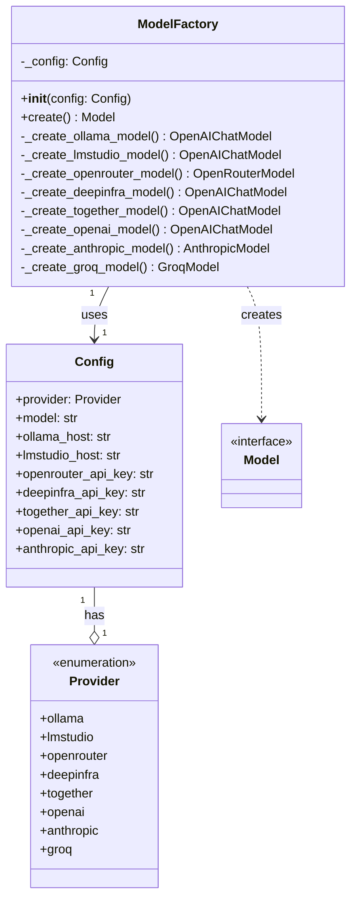

# ModelFactory Class Refactoring

## Overview

Introduce a `ModelFactory` class that encapsulates model creation logic, paired with a `Provider` enum. This provides a clean, testable, and extensible architecture for supporting multiple LLM providers.

## Class Diagram



## Design Benefits

1. **Encapsulation**: All provider-specific logic is contained within the factory class
2. **Testability**: Easy to mock `ModelFactory` in tests, or inject a test config
3. **Single Responsibility**: Each private method handles one provider
4. **Extensibility**: Adding new providers means adding one enum value and one method
5. **Configuration Injection**: Factory receives config, making it easy to use different configs

## File Changes

### 1. Update [`src/deepresearcher2/config.py`](src/deepresearcher2/config.py)

- Add `Provider` enum with values: `ollama`, `lmstudio`, `openrouter`, `deepinfra`, `together`, `openai`, `anthropic`, `groq`
- Remove the `Model` enum
- Change `model: Model` field to `model: str` (free-form)
- Add `provider: Provider` field with default `Provider.ollama`

### 2. Create [`src/deepresearcher2/model_factory.py`](src/deepresearcher2/model_factory.py)

```python
from pydantic_ai.models.openai import OpenAIChatModel
from pydantic_ai.models.anthropic import AnthropicModel
from pydantic_ai.models.groq import GroqModel
from pydantic_ai.models.openrouter import OpenRouterModel
from pydantic_ai.providers.openai import OpenAIProvider
from pydantic_ai.providers.ollama import OllamaProvider
from pydantic_ai.providers.openrouter import OpenRouterProvider
from pydantic_ai.providers.together import TogetherProvider
from pydantic_ai.providers.groq import GroqProvider

from .config import Config, Provider

class ModelFactory:
    """Factory for creating pydantic-ai model instances based on provider configuration."""
    
    def __init__(self, config: Config) -> None:
        self._config = config
    
    def create(self) -> OpenAIChatModel | AnthropicModel | GroqModel | OpenRouterModel:
        """Create and return a model instance based on the configured provider."""
        match self._config.provider:
            case Provider.ollama:
                return self._create_ollama_model()
            case Provider.lmstudio:
                return self._create_lmstudio_model()
            case Provider.openrouter:
                return self._create_openrouter_model()
            case Provider.deepinfra:
                return self._create_deepinfra_model()
            case Provider.together:
                return self._create_together_model()
            case Provider.openai:
                return self._create_openai_model()
            case Provider.anthropic:
                return self._create_anthropic_model()
            case Provider.groq:
                return self._create_groq_model()
    
    def _create_ollama_model(self) -> OpenAIChatModel:
        return OpenAIChatModel(
            self._config.model,
            provider=OllamaProvider(base_url=self._config.ollama_host)
        )
    
    # ... similar private methods for each provider
```

### 3. Update [`src/deepresearcher2/agents.py`](src/deepresearcher2/agents.py)

Replace the inline model creation with factory usage:

```python
from .config import config
from .model_factory import ModelFactory

# Create model using factory
factory = ModelFactory(config)
model = factory.create()

# Agents remain unchanged, just use the model
QUERY_AGENT = Agent(model=model, ...)
```

### 4. Update [`.env.example`](.env.example)

```bash
PROVIDER="ollama"   # Provider: ollama, lmstudio, openrouter, deepinfra, together, openai, anthropic, groq
MODEL="llama3.3"    # Model name (provider-specific string)
```

## Error Handling

- **Invalid provider**: Pydantic validation fails at config load with clear enum error
- **Invalid model name**: Provider raises error at runtime with helpful message
- **Missing API key**: Native pydantic-ai providers raise `UserError` with setup instructions