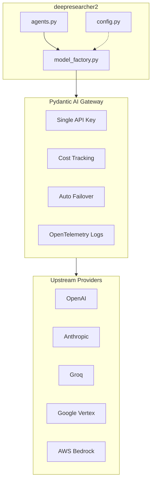
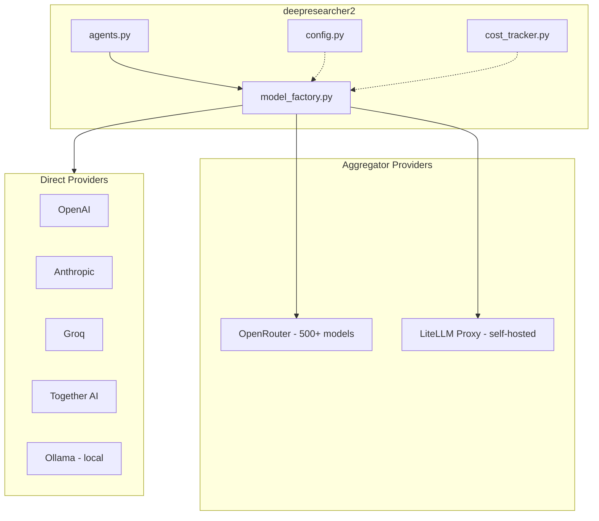

# Multi-Provider Model Hosting Architecture for deepresearcher2

Based on the attached research report and your current codebase, here are two architecture options for integrating cloud model providers.

## Current State Analysis

Your project currently uses:

- Pydantic AI agents with `OpenAIChatModel` and `OpenAIProvider` in [`agents.py`](src/deepresearcher2/agents.py)
- A `Model` enum in [`config.py`](src/deepresearcher2/config.py) with Ollama and OpenAI models
- Direct API keys stored in config (OpenAI, Anthropic, Gemini, etc.)

---

## Option A: Pydantic AI Gateway (Managed Service)



**How it works:**

- Single `PYDANTIC_AI_GATEWAY_API_KEY` replaces all provider API keys
- Use model strings like `gateway:openai/gpt-4o`, `gateway:anthropic/claude-3.5-sonnet`
- Gateway handles routing, failover, and cost tracking automatically

**Key Code Change:**

```python
from pydantic_ai import Agent

# Single gateway key, multiple providers
agent = Agent('gateway:openai/gpt-4o')
# or
agent = Agent('gateway:anthropic/claude-3.5-sonnet')
```

**Pros:**

- Zero translation overhead (native format passthrough)
- Built-in cost limits (daily/weekly/monthly caps at project/user/key levels)
- Integrated with Logfire for observability (you already use `logfire[httpx]`)
- Automatic failover management
- Single API key to manage

**Cons:**

- Currently in Beta (free now, pricing TBD)
- Vendor dependency on Pydantic team
- Does NOT support LiteLLM proxy or OpenRouter directly (only native providers)
- Limited to supported providers (OpenAI, Anthropic, Google Vertex, Groq, AWS Bedrock)

**Tax/Overhead:** Currently FREE in beta. When priced, expected to be pass-through pricing with no markup on inference costs (similar to OpenRouter's model). The value-add is observability and cost management, not arbitrage.---

## Option B: Direct Multi-Provider with Pydantic AI Native Support



**How it works:**

- Create a `ModelFactory` that builds the appropriate model based on config
- Use Pydantic AI's native provider support for each backend
- Implement your own cost tracking via Logfire or custom solution

**Key Code Changes:**

```python
from pydantic_ai import Agent
from pydantic_ai.models.openai import OpenAIChatModel
from pydantic_ai.providers.litellm import LiteLLMProvider
from pydantic_ai.providers.openrouter import OpenRouterProvider

def create_model(model_config: str):
    if model_config.startswith("openrouter:"):
        return Agent(model_config)  # e.g., "openrouter:anthropic/claude-3.5-sonnet"
    
    elif model_config.startswith("litellm:"):
        model_name = model_config.replace("litellm:", "")
        return OpenAIChatModel(
            model_name,
            provider=LiteLLMProvider(
                api_base="http://localhost:4000",  # self-hosted proxy
                api_key=config.litellm_api_key
            )
        )
    
    elif model_config.startswith("together:"):
        return Agent(model_config)  # e.g., "together:meta-llama/Llama-3.1-8B"
    
    elif model_config.startswith("groq:"):
        return Agent(model_config)  # e.g., "groq:llama-3.3-70b-versatile"
    
    elif model_config.startswith("ollama:"):
        return Agent(model_config)  # local models
    
    else:
        return Agent(model_config)  # fallback to pydantic-ai auto-detection
```

**Pros:**

- Full control over provider selection and routing
- Access to 500+ models via OpenRouter
- Self-hosted LiteLLM proxy for maximum privacy/control
- No vendor lock-in to a single gateway
- Can implement custom fallback chains

**Cons:**

- Must manage multiple API keys
- Cost tracking requires custom implementation or Logfire integration
- More complex configuration
- OpenRouter adds 5.5% fee on credit purchases

**Tax/Overhead:**

- **LiteLLM (self-hosted):** No markup, only infrastructure costs
- **OpenRouter:** 5.5% fee on credit purchases, no per-token markup
- **Direct providers:** Native pricing

---

## Recommendation

| Factor | Option A (Gateway) | Option B (Direct) ||--------|-------------------|-------------------|| Setup Complexity | Low | Medium || Cost Tracking | Built-in | DIY or Logfire || Model Breadth | Limited (~5 providers) | Wide (500+ via OpenRouter) || Privacy/Control | Medium | High (can self-host LiteLLM) || Vendor Lock-in | Pydantic team | None || Future Pricing Risk | Unknown (currently free) | Known (OpenRouter 5.5%) |**For deepresearcher2, I recommend Option B** because:

1. Your research report emphasizes open-weight models (Kimi K2, Llama, DeepSeek) - OpenRouter/LiteLLM give broader access
2. You already use Logfire for observability, so cost tracking can be added there
3. The Gateway doesn't currently support LiteLLM or OpenRouter, limiting your provider choices
4. Self-hosted LiteLLM aligns with your "fully local" philosophy for privacy-sensitive workloads

However, if you want the simplest path with built-in cost management and are willing to limit yourself to major providers, Option A is compelling during the free beta period.---

## Implementation Steps (Option B)

1. Add new provider dependencies to `pyproject.toml`
2. Extend `Model` enum in `config.py` with provider prefixes
3. Create `model_factory.py` with provider-aware model creation