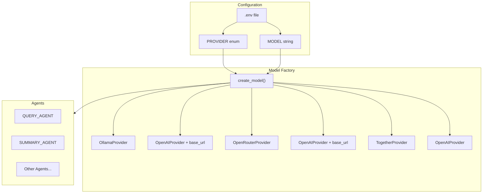

# Multi-Provider Model Factory Refactoring

## Overview

Add a `PROVIDER` field to configuration and implement a model factory that leverages pydantic-ai's native provider support. This enables clean switching between local (Ollama, LM Studio) and cloud providers (OpenRouter, DeepInfra, Together) with free-form model names.

## Architecture



## Key Design Decisions

1. **Factory Pattern**: A single `create_model()` function encapsulates all provider-specific logic
2. **Native pydantic-ai providers**: Use built-in `OllamaProvider`, `OpenRouterProvider`, `TogetherProvider` where available
3. **OpenAI-compatible fallback**: Use `OpenAIProvider` with custom `base_url` for providers without native support (LM Studio, DeepInfra)
4. **Free-form model names**: Remove the `Model` enum, accept any string
5. **Graceful failures**: Invalid providers fail at config load; invalid models fail at runtime with clear errors

## File Changes

### 1. Update [`src/deepresearcher2/config.py`](src/deepresearcher2/config.py)

- Add new `Provider` enum with values: `ollama`, `lmstudio`, `openrouter`, `deepinfra`, `together`, `openai`, `anthropic`, `groq`
- Remove the `Model` enum
- Change `model: Model` field to `model: str` (free-form)
- Add `provider: Provider` field with default `Provider.ollama`

### 2. Create new [`src/deepresearcher2/providers.py`](src/deepresearcher2/providers.py)

New module containing the model factory:

```python
def create_model(provider: Provider, model_name: str) -> OpenAIChatModel | AnthropicModel | GroqModel:
    """Create a pydantic-ai model instance based on provider configuration."""
    match provider:
        case Provider.ollama:
            return OpenAIChatModel(model_name, provider=OllamaProvider(base_url=config.ollama_host))
        case Provider.lmstudio:
            return OpenAIChatModel(model_name, provider=OpenAIProvider(base_url=config.lmstudio_host))
        case Provider.openrouter:
            return OpenRouterModel(model_name, provider=OpenRouterProvider())
        case Provider.deepinfra:
            return OpenAIChatModel(model_name, provider=OpenAIProvider(
                base_url="https://api.deepinfra.com/v1/openai",
                api_key=config.deepinfra_api_key
            ))
        case Provider.together:
            return OpenAIChatModel(model_name, provider=TogetherProvider())
        case Provider.openai:
            return OpenAIChatModel(model_name, provider=OpenAIProvider())
        case Provider.anthropic:
            return AnthropicModel(model_name)
        case Provider.groq:
            return GroqModel(model_name, provider=GroqProvider())
```

### 3. Update [`src/deepresearcher2/agents.py`](src/deepresearcher2/agents.py)

- Remove the inline model creation logic (the `if "openai" in config.model.value` block)
- Import and use the factory: `model = create_model(config.provider, config.model)`

### 4. Update [`.env.example`](.env.example)

Add `PROVIDER` field and update `MODEL` comment:

```bash
PROVIDER="ollama"                        # Provider: ollama, lmstudio, openrouter, deepinfra, together, openai, anthropic, groq
MODEL="llama3.3"                         # Model name (provider-specific, e.g., "llama3.3" for Ollama, "meta-llama/Llama-3.3-70B-Instruct" for OpenRouter)
```

## Error Handling

- **Invalid provider**: Pydantic validation fails at config load with clear enum values
- **Invalid model name**: pydantic-ai raises an error at runtime when the model is used
- **Missing API key**: Native providers raise `UserError` with helpful messages (e.g., "Set the OPENROUTER_API_KEY environment variable...")

## Testing Considerations

- Unit tests for `create_model()` with mocked providers
- Integration tests can use the existing cassette-based approach