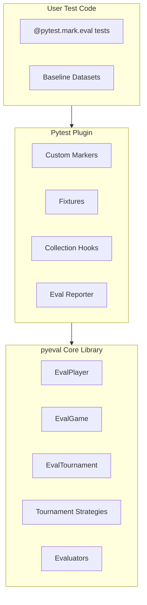

# pyeval Framework Design

## Overview

`pyeval` is a pytest plugin for evaluating AI agents in CI/CD pipelines. It enables comparative evaluations (Bradley-Terry tournaments) and absolute evaluations (rubrics, LLM judges) to run alongside regular unit tests.

## Architecture



## Package Structure

```
pyeval/
├── pyproject.toml
├── README.md
├── src/
│   └── pyeval/
│       ├── __init__.py
│       ├── core/
│       │   ├── __init__.py
│       │   ├── player.py          # EvalPlayer
│       │   ├── game.py            # EvalGame
│       │   ├── tournament.py      # EvalTournament
│       │   └── strategies.py      # Tournament strategies
│       ├── evaluators/
│       │   ├── __init__.py
│       │   ├── base.py            # Abstract Evaluator
│       │   ├── comparative.py     # Bradley-Terry comparative
│       │   ├── llm_judge.py       # LLM-based judging
│       │   └── exact_match.py     # Deterministic evaluators
│       ├── datasets/
│       │   ├── __init__.py
│       │   ├── dataset.py         # EvalDataset
│       │   └── case.py            # EvalCase
│       ├── plugin.py              # Pytest plugin entry point
│       ├── fixtures.py            # Pytest fixtures
│       ├── markers.py             # Custom markers
│       └── reporting.py           # Results reporting
└── tests/
```

## Key Components

### 1. Core Classes (from existing evals.py)

**EvalPlayer** - Item being evaluated with score tracking:

```python
class EvalPlayer(BaseModel):
    idx: int
    item: Any  # Generalized from str
    score: float | None = None
    metadata: dict[str, Any] = {}
```

**EvalGame** - Pairwise comparison definition:

```python
class EvalGame(BaseModel):
    criterion: str
    judge_model: str = "gpt-4o"
    
    async def run(self, players: tuple[EvalPlayer, EvalPlayer], ...) -> tuple[int, int]
```

**EvalTournament** - Tournament orchestrator with strategies:

- `random_sampling_strategy`
- `round_robin_strategy`  
- `adaptive_uncertainty_strategy` (default)

### 2. Evaluators

**Abstract Base**:

```python
class Evaluator(ABC):
    async def evaluate(self, output: Any, expected: Any, context: EvalContext) -> EvalResult
```

**Comparative Evaluator** - Bradley-Terry tournaments:

```python
class ComparativeEvaluator(Evaluator):
    criterion: str
    strategy: TournamentStrategy = adaptive_uncertainty_strategy
```

**LLMJudge Evaluator** - Rubric-based scoring:

```python
class LLMJudge(Evaluator):
    rubric: str
    model: str = "gpt-4o"
    scale: tuple[float, float] = (0.0, 1.0)
```

### 3. Pytest Integration

**Custom Markers**:

```python
@pytest.mark.eval                    # Mark as evaluation test
@pytest.mark.eval_baseline           # Generate/update baseline
@pytest.mark.eval_comparative        # Comparative evaluation
@pytest.mark.eval_slow              # Long-running eval (skip in quick runs)
```

**Fixtures**:

```python
@pytest.fixture
def eval_dataset(request) -> EvalDataset:
    """Load/create evaluation dataset for the test"""

@pytest.fixture  
def eval_tournament(request) -> EvalTournament:
    """Preconfigured tournament with default strategy"""

@pytest.fixture
def eval_baseline(request, tmp_path) -> BaselineManager:
    """Manage baseline outputs for comparison"""
```

**Hooks**:

```python
def pytest_configure(config):
    """Register markers and configure pyeval"""

def pytest_collection_modifyitems(session, config, items):
    """Filter/order eval tests based on CLI options"""

def pytest_terminal_summary(terminalreporter, exitstatus, config):
    """Display eval-specific summary with scores"""
```

### 4. CLI Options

```bash
pytest --eval                     # Run only evaluation tests
pytest --eval-baseline            # Update baselines
pytest --eval-report=json         # Output format (json, html, markdown)
pytest --eval-threshold=0.8       # Minimum score threshold
pytest --eval-compare=main        # Compare against branch baseline
```

### 5. Usage Example

```python
import pytest
from pyeval import EvalDataset, EvalCase, ComparativeEvaluator

@pytest.mark.eval
@pytest.mark.eval_comparative
async def test_query_creativity(eval_tournament, query_agent):
    """Test that novel prompts generate more creative queries than baseline."""
    
    topics = ["molecular gastronomy", "kintsugi philosophy"]
    players = []
    
    for idx, topic in enumerate(topics):
        baseline = await query_agent.run(f"Generate query for: {topic}")
        novel = await query_agent.run(f"Generate creative query for: {topic}")
        
        players.append(EvalPlayer(idx=idx*2, item=baseline.output))
        players.append(EvalPlayer(idx=idx*2+1, item=novel.output))
    
    game = EvalGame(criterion="Which query shows more creativity?")
    results = await eval_tournament.run(players=players, game=game)
    
    baseline_scores = [p.score for p in results[::2]]
    novel_scores = [p.score for p in results[1::2]]
    
    assert np.mean(novel_scores) > np.mean(baseline_scores)
```

### 6. Baseline Management

- Store baselines in `tests/baselines/` as JSON files
- Version alongside code in git
- CI compares feature branch outputs against main branch baselines
- `--eval-baseline` flag regenerates baselines

### 7. Reporting

**Console Output**:

```
========================= EVALUATION RESULTS =========================
test_query_creativity
  Comparative Score: novel +2.34 vs baseline -2.34
  Games Played: 45 | Strategy: adaptive_uncertainty
  Winner: novel (p < 0.05)
  
test_response_quality  
  LLMJudge Score: 0.87/1.00
  Rubric: "Response is helpful, accurate, and concise"
======================================================================
```

**JSON/HTML Reports** for CI dashboards

## Dependencies

- pytest >= 8.0
- pydantic >= 2.0
- pydantic-ai (for LLM integration)
- choix (for Bradley-Terry scoring)
- numpy

## Migration Path

1. Extract core classes from `deepresearcher2/evals/evals.py`
2. Generalize `EvalPlayer.item` from `str` to `Any`
3. Add pytest plugin infrastructure
4. Create fixtures wrapping existing tournament logic
5. Add CLI options and reporting