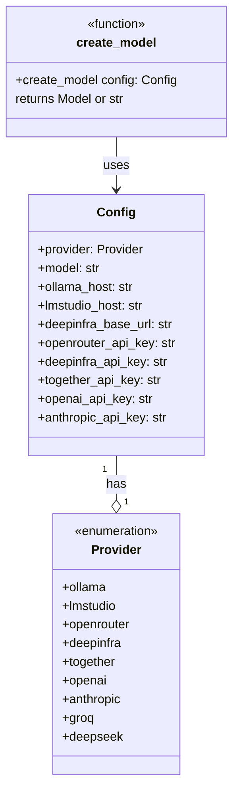

# Simplified Provider Refactoring

## Analysis of Current Plan vs pydantic-ai Capabilities

The original plan proposes a `ModelFactory` class with 8+ private methods. However, pydantic-ai already provides:

1. **Native shorthand strings**: `Agent("provider:model")` works for most providers
2. **Built-in provider classes** that auto-read API keys from environment variables
3. **OpenAI-compatible fallback** via `OpenAIProvider(base_url=...)` for custom endpoints

### Built-in Providers with Shorthand Support

| Provider | Shorthand | Provider Class ||----------|-----------|----------------|| OpenAI | `openai:gpt-4o` | `OpenAIProvider` || Anthropic | `anthropic:claude-3-5-sonnet` | `AnthropicProvider` || Groq | `groq:llama-3.3-70b` | `GroqProvider` || Ollama | `ollama:llama3.3` | `OllamaProvider` || OpenRouter | `openrouter:model` | `OpenRouterProvider` || Together | `together:model` | `TogetherProvider` || DeepSeek | `deepseek:deepseek-chat` | `DeepSeekProvider` |

### No Dedicated Provider (Use OpenAIProvider)

- **LM Studio**: No `LMStudioProvider` exists - use `OpenAIProvider(base_url=lmstudio_host)`
- **DeepInfra**: No `DeepInfraProvider` exists - use `OpenAIProvider(base_url="https://api.deepinfra.com/v1/openai")`

## Recommended Approach

Instead of a complex `ModelFactory` class, use:

1. A `Provider` enum (simplified)
2. A simple `create_model()` function that leverages pydantic-ai's native patterns
3. Store model as `str` in config (e.g., `"llama3.3"` or `"gpt-4o"`)

## Updated Class Diagram




## File Changes

### 1. Update [config.py](src/deepresearcher2/config.py)

- Add `Provider` enum with values: `ollama`, `lmstudio`, `openrouter`, `deepinfra`, `together`, `openai`, `anthropic`, `groq`, `deepseek`
- Remove the `Model` enum
- Change `model: Model` to `model: str` (free-form model name)
- Add `provider: Provider` field with default `Provider.ollama`
- Add `deepinfra_base_url: str` field (default: `"https://api.deepinfra.com/v1/openai"`)

### 2. Create [model_factory.py](src/deepresearcher2/model_factory.py)

A lightweight module with a single `create_model()` function:

```python
from pydantic_ai.models.openai import OpenAIChatModel
from pydantic_ai.providers.openai import OpenAIProvider

from .config import Config, Provider

ModelType = str | OpenAIChatModel

def create_model(config: Config) -> ModelType:
    """Create a model instance based on provider configuration.
    
    For providers with native pydantic-ai support, returns a shorthand string.
    For custom providers (LM Studio, DeepInfra), returns an OpenAIChatModel.
    """
    match config.provider:
        # Native pydantic-ai shorthand (auto-reads API keys from env)
        case Provider.openai:
            return f"openai:{config.model}"
        case Provider.anthropic:
            return f"anthropic:{config.model}"
        case Provider.groq:
            return f"groq:{config.model}"
        case Provider.ollama:
            return f"ollama:{config.model}"
        case Provider.openrouter:
            return f"openrouter:{config.model}"
        case Provider.together:
            return f"together:{config.model}"
        case Provider.deepseek:
            return f"deepseek:{config.model}"
        
        # Custom OpenAI-compatible endpoints (no native provider)
        case Provider.lmstudio:
            return OpenAIChatModel(
                config.model,
                provider=OpenAIProvider(base_url=config.lmstudio_host)
            )
        case Provider.deepinfra:
            return OpenAIChatModel(
                config.model,
                provider=OpenAIProvider(
                    base_url=config.deepinfra_base_url,
                    api_key=config.deepinfra_api_key
                )
            )
```


### 3. Update [agents.py](src/deepresearcher2/agents.py)

Replace inline model creation:

```python
from .config import config
from .model_factory import create_model

model = create_model(config)

# Agents remain unchanged
QUERY_AGENT = Agent(model=model, ...)
```


### 4. Update [.env.example](.env.example)

```bash
PROVIDER="ollama"          # Provider: ollama, lmstudio, openrouter, deepinfra, together, openai, anthropic, groq, deepseek
MODEL="llama3.3"           # Model name (provider-specific string, e.g., "gpt-4o", "claude-3-5-sonnet", "llama3.3")
DEEPINFRA_BASE_URL="https://api.deepinfra.com/v1/openai"  # DeepInfra API endpoint
```


## Benefits Over Original Plan