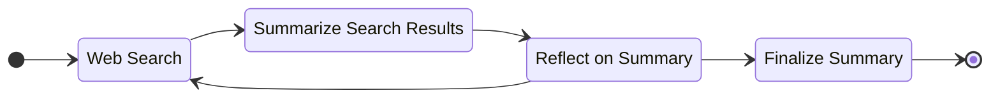

# Deep Researcher 2

Fully local web research and report writing assistant.

## Getting started
1. Install [Ollama](https://ollama.com) and pull a model.
   ```bash
   ollama pull llama3.3
   ```
2. Create an `.env` file and fill in the placeholders including the `TOPIC`.
   ```bash
   cp .env.example .env
   ```
3. Start up the workflow.
   ```bash
   uv run research
   ```


<br>*Deep Researcher 2 workflow*
<br>
<br>

## UML diagrams


<br>*Deep Researcher 2 class structure*

<br>


<br>*Deep Researcher 2 package structure*

<br>
<br>
