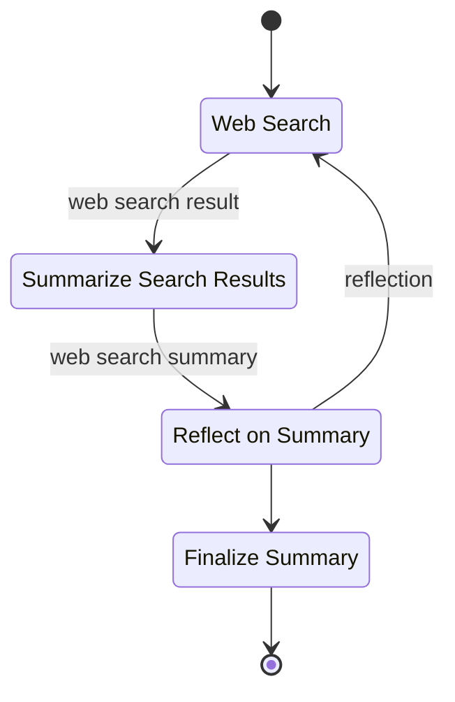

<div align="center">
  <a href="https://github.com/lars20070/deepresearcher2/">
    <picture>
      
    </picture>
  </a>
</div>

[](https://codecov.io/gh/lars20070/deepresearcher2)
[](https://github.com/lars20070/deepresearcher2/actions/workflows/build.yaml)
[](https://www.python.org/downloads/)
[](https://deepwiki.com/lars20070/deepresearcher2)
[](https://github.com/lars20070/deepresearcher2/blob/master/LICENSE)

A fully local web research and report writing assistant that protects your privacy.
The AI models run locally using [Ollama](https://ollama.com) or [LM Studio](https://lmstudio.ai), and web searches are performed locally with [SearXNG](https://searxng.org). By default, no API keys are required.

**Note:** Steps 1 and 2 are optional. You can instead run models and web searches in the cloud. To do so, add the required API keys to your `.env` file. Supported model providers include OpenRouter, Together AI, DeepInfra, and OpenAI. For web searches, Deep Researcher 2 supports Brave, DuckDuckGo, Perplexity, Serper and Tavily.


## Getting started
1. Install [Ollama](https://ollama.com) and download a model.
   ```bash
   ollama pull qwen2.5:72b
   ```
2. Start [SearXNG](https://docs.searxng.org).
   ```bash
   git clone git@github.com:lars20070/searxng-docker.git
   cd searxng-docker
   sed -i '' "s|ultrasecretkey|$(openssl rand -hex 32)|g" searxng/settings.yml
   docker compose up -d
   # Check localhost:8080
   ```
3. Set up environment variables.<br>
Create a `.env` file and fill in the placeholders including the `TOPIC`.
   ```bash
   cp .env.example .env
   ```
4. Start up the workflow.
   ```bash
   uv run research
   ```


<br>*Deep Researcher 2 workflow*
<br>
<br>

## UML diagrams


<br>*Deep Researcher 2 class structure*

<br>


<br>*Deep Researcher 2 package structure*

<br>
<br>
