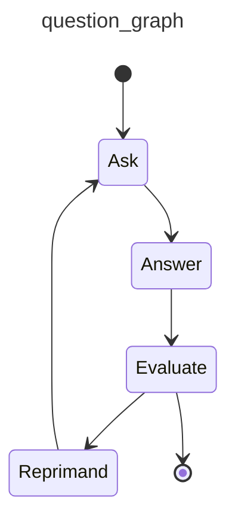

# Deep Researcher 2

fully local web research and report writing assistant

## UML diagrams

 *Deep Researcher 2 package structure*

 

 *Deep Researcher 2 class structure*

``` mermaid
---
title: question_graph
---
stateDiagram-v2
  [*] --> Ask
  Ask --> Answer
  Answer --> Evaluate
  Evaluate --> Reprimand
  Evaluate --> [*]
  Reprimand --> Ask
```
