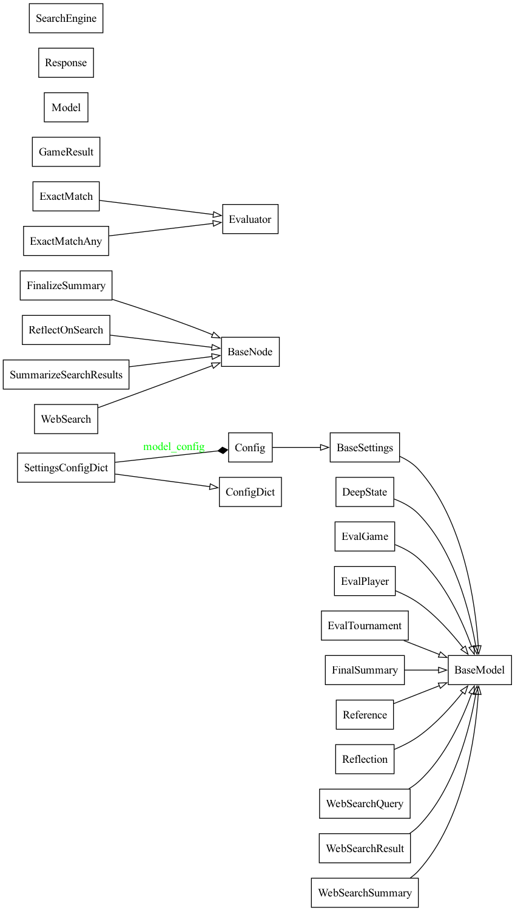

# Deep Researcher 2

fully local web research and report writing assistant

## UML diagrams

 *Deep Researcher 2 package structure*

 

 *Deep Researcher 2 class structure*

 *Deep Researcher 2 design*

 *state class*

## Models and MCPs

* coordinator models for tool/MCP use
  * Llama 3.3 `llama3.3` (Meta)
  * Mistral Nemo `mistral-nemo` (Mistral + Nvidia)
  * Firefunction v2 `firefunction-v2` (Fireworks AI)
* search MCP
  * [DuckDuckGo MCP](https://github.com/nickclyde/duckduckgo-mcp-server)
