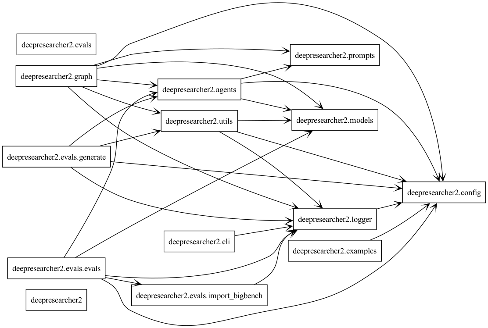

# Deep Researcher 2

[](https://codecov.io/gh/lars20070/deepresearcher2)
[](https://github.com/lars20070/deepresearcher2/actions/workflows/build.yaml)
[](https://www.python.org/downloads/)
[](https://github.com/lars20070/deepresearcher2/blob/master/LICENSE)

A fully local web research and report writing assistant that protects your privacy.
The AI models run locally using Ollama, and web searches are performed locally with SearXNG.
By default, no API keys are needed.

**Note:** Steps 1 and 2 are optional. You can choose to run the models and web searches in the cloud instead.
If you do, you must add the required API keys to the `.env` file.


## Getting started
1. Install [Ollama](https://ollama.com) and download a model.
   ```bash
   ollama pull qwen2.5:72b
   ```
2. Start [SearXNG](https://docs.searxng.org).
   ```bash
   git clone git@github.com:lars20070/searxng-docker.git
   cd searxng-docker
   sed -i '' "s|ultrasecretkey|$(openssl rand -hex 32)|g" searxng/settings.yml
   docker compose up -d
   # Check localhost:8080
   ```
3. Set up environment variables.<br>
Create a `.env` file and fill in the placeholders including the `TOPIC`.
   ```bash
   cp .env.example .env
   ```
4. Start up the workflow.
   ```bash
   uv run research
   ```


<br>*Deep Researcher 2 workflow*
<br>
<br>

## UML diagrams


<br>*Deep Researcher 2 class structure*

<br>


<br>*Deep Researcher 2 package structure*

<br>
<br>
